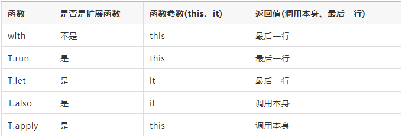

# Kotlin 作用域函数与扩展

## 扩展
Kotlin能够扩展⼀个类的新功能⽽⽆需继承该类或者使⽤像装饰者这样的设计模式。 这通过叫做扩展的特殊声明完成。

### 扩展函数
类添加静态方法

## 作用域函数 apply/with/run/also/let
唯一目的是在对象的上下文中执行代码块。当对一个对象调用这样的函数并提供一个 lambda 表达式时，它会形成一个临时作用域。在此作用域中，可以访问该对象而无需其名称。这些函数称为作用域函数。

run, with, let, also, apply  都是作用域函数，这些作用域函数如何使用，以及如何区分呢，我们将从以下三个方面来区分它们。

* 是否是扩展函数。
* 作用域函数的参数（this、it）。
* 作用域函数的返回值（调用本身、其他类型即最后一行）。

首先我们来看一下 with 和 T.run，这两个函数非常的相似，他们的区别在于 with 是个普通函数，T.run 是个扩展函数，来看一下下面的例子。

	val name: String? = null
	with(name){
	    val subName = name!!.substring(1,2)
	}
	
	// 使用之前可以检查它的可空性
	name?.run { val subName = name.substring(1,2) }?:throw IllegalArgumentException("name must not be null")

作用域函数的参数（this、it）

T.run 和 T.let，它们都是扩展函数，但是他们的参数不一样 T.run 的参数是 this, T.let 的参数是 it。
	val name: String? = "hi-dhl.com"
	
	// 参数是 this，可以省略不写
	name?.run {
	    println("The length  is ${this.length}  this 是可以省略的 ${length}")
	}
	
	// 参数 it
	name?.let {
	    println("The length  is  ${it.length}")
	}
	
	// 自定义参数名字
	name?.let { str ->
	    println("The length  is  ${str.length}")
	}

T.let 和 T.also 它们接受的参数都是 it, 但是它们的返回值是不同的 T.let 返回最后一行，T.also 返回调用本身。
	var name = "hi-dhl"
	
	// 返回调用本身
	name = name.also {
	    val result = 1 * 1
	    "juejin"
	}
	println("name = ${name}") // name = hi-dhl
	
	// 返回的最后一行
	name = name.let {
	    val result = 1 * 1
	    "hi-dhl.com"
	}
	println("name = ${name}") // name = hi-dhl.com

从上面的例子来看 T.also 似乎没有什么意义，细想一下其实是非常有意义的，在使用之前可以进行自我操作，结合其他的函数，功能会更强大。

	fun makeDir(path: String) = path.let{ File(it) }.also{ it.mkdirs() }

### 引用上下文对象的方式
run、with 以及 apply 通过关键字 this 引用上下文对象。let 及 also 将上下文对象作为 lambda 表达式参数用it.
### 返回值
apply 及 also 的返回值是上下文对象本身。因此，它们可以作为辅助步骤包含在调用链中：你可以继续在同一个对象上进行链式函数调用。let、run 及 with 返回 lambda 表达式的结果。
