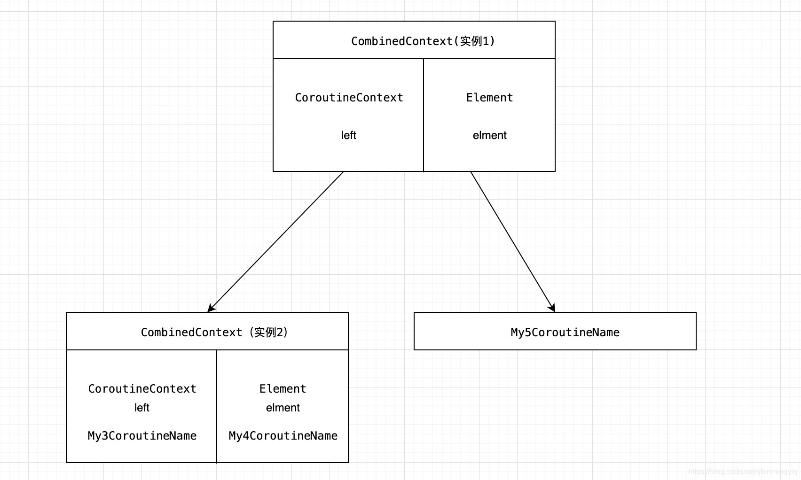
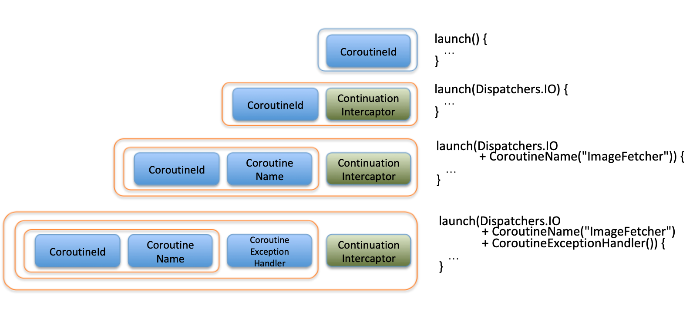
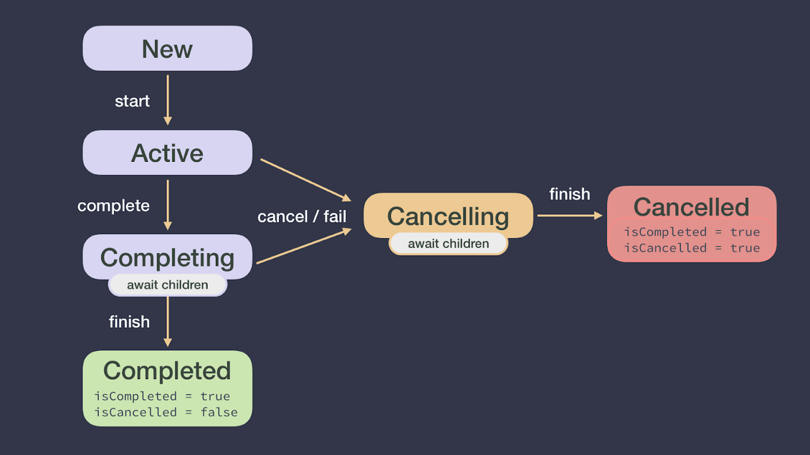
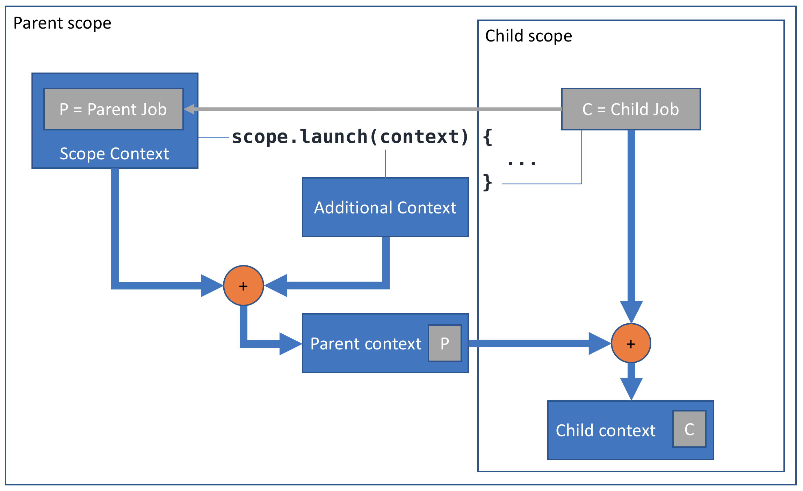
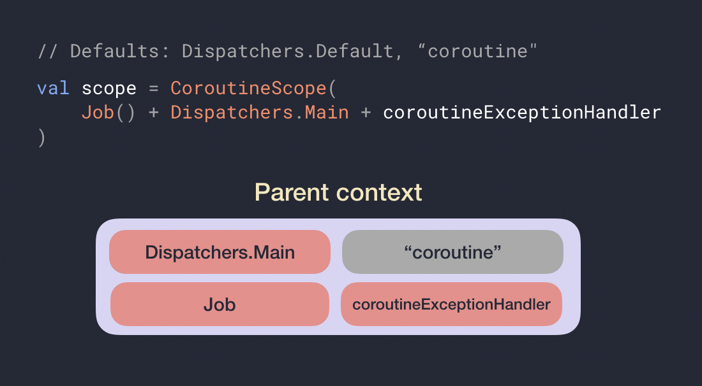
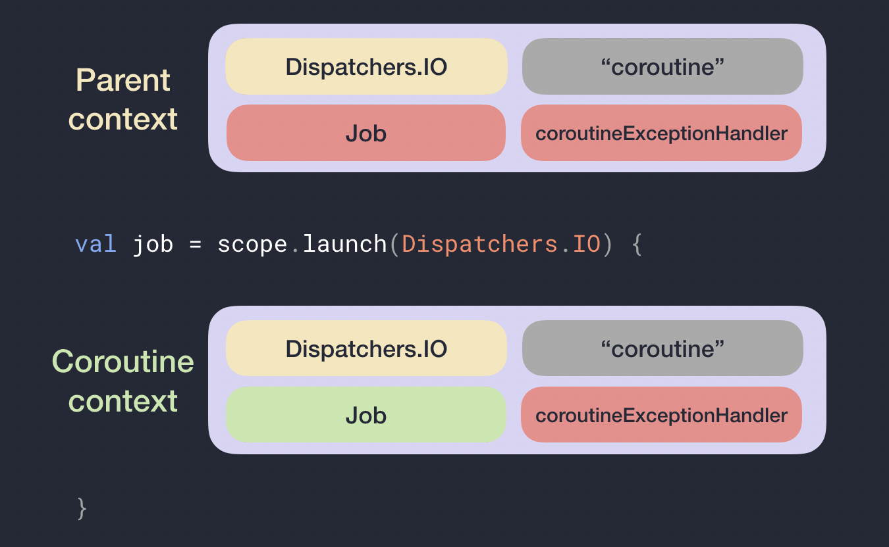
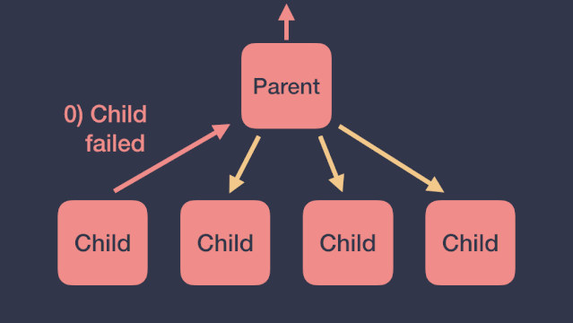
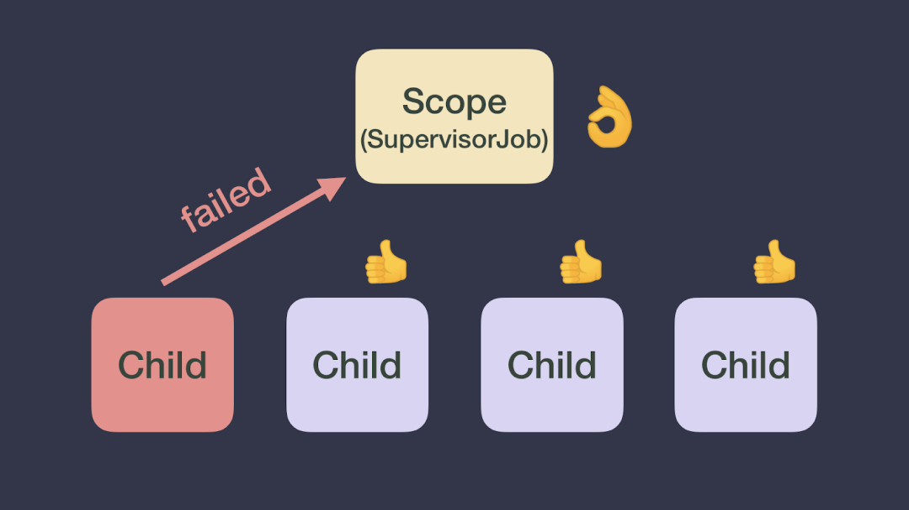

# Kotlin 协程基础知识点与高频面试题

## 一、协程基础概念

### 1.1 什么是协程

协程是一种脱离语言的概念，它是一种编程思想，并不局限于特定的语言。本质上来说，协程就是一段程序，它能够被挂起，待会儿再恢复执行。语言会对协程有自己的实现。

协程(coroutine)的概念根据 Donald Knuth 的说法早在 1958 年就由 Melvin Conway 提出了，对应 wikipedia 的定义如下：

> Coroutines are computer program components that generalize subroutines for non-preemptive multitasking, by allowing execution to be suspended and resumed. Coroutines are well-suited for implementing familiar program components such as cooperative tasks, exceptions, event loops, iterators, infinite lists and pipes.

子例程(subroutine)是一个概括性的术语，子例程可以是整个程序中的一个代码区块，当它被主程序调用的时候就会进入运行。例如函数就是子例程中的一种。协程相比子例程更加的灵活，允许执行过程中被挂起和恢复，多个协程可以一起相互协作执行任务。从协程(co + routine)名字上来拆解为支持协作(cooperate)的例程。

### 1.2 进程、线程、协程的关系和比较

* 进程是资源分配的最小单位，会拥有独立的地址空间以及对应的内存空间，还有网络和文件资源等，不同进程之间资源都是独立的，可以通过进程间通信（管道、共享内存、信号量等方式）来进行交互。
* 线程为 CPU 调度的基本单位，除了拥有运行中必不可少的信息(如程序计数器、一组寄存器和栈)以外，本身并不拥有系统资源，所有线程会共享进程的资源，比如会共享堆资源。
* 协程可以认为是运行在线程上的代码块，协程提供的挂起操作会使协程暂停执行，而不会导致线程阻塞。一个线程内部可以创建几千个协程都没有任何问题。
* 进程的切换和线程切换中都包含了对应上下文的切换，这块都涉及到了内核来完成，即一次用户态到内核态的切换和一次内核态到用户态的切换。因为进程上下文切换保存的信息更多，所以进程切换代价会比线程切换代价更大。
* 协程是一个纯用户态的并发机制，同一时刻只会有一个协程在运行，其他协程挂起等待；不同协程之间的切换不涉及内核，只用在用户态切换即可，所以切换代价更小，更轻量级，适合 IO 密集型的场景。

| 维度 | 进程 | 线程 | 协程 |
| --- | --- | --- | --- |
| 定位 | 资源分配最小单位 | CPU 调度基本单位 | 用户态并发任务 |
| 切换开销 | 最大（内核态切换） | 中（内核态切换） | 最小（用户态切换） |
| 数量级 | 几十 | 几百 | 几千~几万 |
| 阻塞行为 | 阻塞整个进程 | 阻塞当前线程 | 挂起，不阻塞线程 |

### 1.3 Kotlin 协程的定位

在 JVM 的平台上，并没有提供对协程的原生支持，完全依赖编译器技术支持。Kotlin 协程在代码层面实现要基于线程池的工具 API，所以 Kotlin 协程不属于广义上的协程，更像是一个线程框架。

### 1.4 协程原理概述

* 挂起函数：suspend 修饰标记的函数。挂起函数不能在常规代码中被调用，只能在其他挂起函数或是挂起 lambda 表达式中。
* 协程构建器：使用一些挂起 lambda 表达式作为参数来创建的一个协程的函数，如 launch()、async()。
* 在协程等待的过程中，线程会返回线程池，当协程等待结束，协程会在线程池中一个空闲的线程上恢复 (The thread is returned to the pool while the coroutine is waiting, and when the waiting is done, the coroutine resumes on a free thread in the pool.)。

## 二、协程实现原理

### 2.1 CPS(Continuation-Passing-Style Transformation)

```kotlin
// 编译前
suspend fun request(): Int

// 编译后
fun request(continuation: Continuation<Int>): Any?
```

* suspend 函数都有一个 Continuation 类型的隐式参数，并且都能通过这个参数拿到一个 Continuation 类型对象。
* 返回类型变成 Any?，因为挂起函数被挂起时，会返回 COROUTINE_SUSPENDED；否则执行完毕直接返回一个结果或是异常，需要一个联合标识。

### 2.2 Continuation 续体

Continuation 表示挂起协程在挂起点时的状态，可以用"剩余计算"来称呼。

```kotlin
val str = 1024.toString() // #1
val length = str.length   // #2
println(length)           // #3
```

假如把 #1，#2 和 #3 分成两部分代码段，#2，#3 的代码可以合并表示为 `println(x.length)`，然后改写成一个 lambda 表达式：

```kotlin
{ s: String -> println(s.length) }
```

这样，我们就可以通过把 #1 的结果传递给 lambda 来重新构建原始的形式：

```kotlin
{ s: String -> println(s.length) }.invoke(1024.toString())
```

这个 lambda 表达式就是 #1 的 Continuation，通过它的 invoke 方法可以执行剩余计算。

### 2.3 状态机

挂起点：协程执行过程中可能被挂起的位置，可理解为剩余计算各种可能点。每一个挂起点和初始挂起点对应的 Continuation 都会转化为一种状态，协程恢复只是跳到下一种状态中。

协程在挂起前，会先保存所有的局部变量以及在下次 resume 后要执行的代码片段（根据 label 的值判断），这个保存状态和局部变量的对象就叫状态机。考虑用状态机来实现协程是尽可能少的创建类和对象。

### 2.4 总结

1. 在执行 suspend 函数时，（CPS 传递 Continuation 参数）挂起，暂时不执行剩下的协程代码。
2. 当 suspend 函数执行完毕，通过 Continuation 参数的 resume() 进行回调，继续执行。

```kotlin
@SinceKotlin("1.3")
public interface Continuation<in T> {
    /**
     * The context of the coroutine that corresponds to this continuation.
     */
    public val context: CoroutineContext

    /**
     * Resumes the execution of the corresponding coroutine passing a successful or failed [result] as the
     * return value of the last suspension point.
     */
    public fun resumeWith(result: Result<T>)
}

/**
 * Classes and interfaces marked with this annotation are restricted when used as receivers for extension
 * `suspend` functions. These `suspend` extensions can only invoke other member or extension `suspend` functions on this particular
 * receiver and are restricted from calling arbitrary suspension functions.
 */
@SinceKotlin("1.3")
@Target(AnnotationTarget.CLASS)
@Retention(AnnotationRetention.BINARY)
public annotation class RestrictsSuspension

/**
 * Resumes the execution of the corresponding coroutine passing [value] as the return value of the last suspension point.
 */
@SinceKotlin("1.3")
@InlineOnly
public inline fun <T> Continuation<T>.resume(value: T): Unit =
    resumeWith(Result.success(value))

/**
 * Resumes the execution of the corresponding coroutine so that the [exception] is re-thrown right after the
 * last suspension point.
 */
@SinceKotlin("1.3")
@InlineOnly
public inline fun <T> Continuation<T>.resumeWithException(exception: Throwable): Unit =
    resumeWith(Result.failure(exception))
```

## 三、启动协程

### 3.1 runBlocking，连接 blocking 和 non-blocking 的世界

runBlocking 用来连接阻塞和非阻塞的世界。runBlocking 可以建立一个阻塞当前线程的协程，所以它主要被用来在 main 函数中或者测试中使用，作为连接函数。

```kotlin
fun main() = runBlocking<Unit> {
    // start main coroutine
    GlobalScope.launch {
        // launch a new coroutine in background and continue
        delay(1000L)
        println("World! + ${Thread.currentThread().name}")
    }
    println("Hello, + ${Thread.currentThread().name}") // main coroutine continues here immediately
    delay(2000L) // delaying for 2 seconds to keep JVM alive
}
```

### 3.2 launch

返回 Job，上面的例子 delay 了一段时间来等待一个协程结束，不是一个好的方法。launch 返回 Job，代表一个协程，我们可以用 Job 的 join() 方法来显式地等待这个协程结束：

```kotlin
fun main() = runBlocking {
    val job = GlobalScope.launch {
        // launch a new coroutine and keep a reference to its Job
        delay(1000L)
        println("World! + ${Thread.currentThread().name}")
    }
    println("Hello, + ${Thread.currentThread().name}")
    job.join() // wait until child coroutine completes
}
```

### 3.3 async，从协程返回值

async 开启协程，返回 Deferred<T>，Deferred<T> 是 Job 的子类，有一个 await() 函数，可以返回协程的结果。await() 也是 suspend 函数，只能在协程之内调用。

```kotlin
fun main() = runBlocking {
    // @coroutine#1
    println(Thread.currentThread().name)
    val deferred: Deferred<Int> = async {
        // @coroutine#2
        loadData()
    }
    println("waiting..." + Thread.currentThread().name)
    println(deferred.await()) // suspend @coroutine#1
}

suspend fun loadData(): Int {
    println("loading..." + Thread.currentThread().name)
    delay(1000L) // suspend @coroutine#2
    println("loaded!" + Thread.currentThread().name)
    return 42
}
```

## 四、核心组件

### 4.1 概览

```kotlin
public fun CoroutineScope.launch(
    context: CoroutineContext = EmptyCoroutineContext,
    start: CoroutineStart = CoroutineStart.DEFAULT,
    block: suspend CoroutineScope.() -> Unit
): Job {
...
}
```

协程总是在一个 context 下运行，类型是接口 CoroutineContext。协程的 context 是一个索引集合，其中包含各种元素，重要元素就有 Job 和 dispatcher。

构建协程的 coroutine builder：launch、async，都是 CoroutineScope 类型的扩展方法。查看 CoroutineScope 接口，其中含有 CoroutineContext 的引用。

### 4.2 CoroutineStart 启动模式

```kotlin
public enum class CoroutineStart {
    DEFAULT,
    LAZY,

    @ExperimentalCoroutinesApi
    ATOMIC,

    @ExperimentalCoroutinesApi
    UNDISPATCHED;
}
```

* CoroutineStart.DEFAULT：不需要手动调用 Job 对象的 join() 或 start() 等方法，而是调用 launch() 方法的时候就会立即执行协程体的代码。
* CoroutineStart.LAZY：一定要手动调用 Job 对象的 join() 或 start() 方法，否则协程体不会执行。
* CoroutineStart.ATOMIC：立即执行且不可被取消，在协程开始执行之前无法 cancel。
* CoroutineStart.UNDISPATCHED：立即在当前线程执行协程体，直到第一个挂起点，不经过调度器分发。

### 4.3 CoroutineContext

它包含用户定义的一些数据集合，这些数据与协程密切相关。它类似于 map 集合，可以通过 key 来获取不同类型的数据。

```kotlin
public interface CoroutineContext {
    /**
     * Returns the element with the given [key] from this context or `null`.
     */
    public operator fun <E : Element> get(key: Key<E>): E?

    /**
     * Accumulates entries of this context starting with [initial] value and applying [operation]
     * from left to right to current accumulator value and each element of this context.
     */
    public fun <R> fold(initial: R, operation: (R, Element) -> R): R

    /**
     * Returns a context containing elements from this context and elements from  other [context].
     * The elements from this context with the same key as in the other one are dropped.
     */
    public operator fun plus(context: CoroutineContext): CoroutineContext =
        if (context === EmptyCoroutineContext) this else // fast path -- avoid lambda creation
            context.fold(this) { acc, element ->
                val removed = acc.minusKey(element.key)
                if (removed === EmptyCoroutineContext) element else {
                    // make sure interceptor is always last in the context (and thus is fast to get when present)
                    val interceptor = removed[ContinuationInterceptor]
                    if (interceptor == null) CombinedContext(removed, element) else {
                        val left = removed.minusKey(ContinuationInterceptor)
                        if (left === EmptyCoroutineContext) CombinedContext(element, interceptor) else
                            CombinedContext(CombinedContext(left, element), interceptor)
                    }
                }
            }

    /**
     * Returns a context containing elements from this context, but without an element with
     * the specified [key].
     */
    public fun minusKey(key: Key<*>): CoroutineContext

    /**
     * Key for the elements of [CoroutineContext]. [E] is a type of element with this key.
     */
    public interface Key<E : Element>

    /**
     * An element of the [CoroutineContext]. An element of the coroutine context is a singleton context by itself.
     */
    public interface Element : CoroutineContext {
        /**
         * A key of this coroutine context element.
         */
        public val key: Key<*>

        public override operator fun <E : Element> get(key: Key<E>): E? =
            @Suppress("UNCHECKED_CAST")
            if (this.key == key) this as E else null

        public override fun <R> fold(initial: R, operation: (R, Element) -> R): R =
            operation(initial, this)

        public override fun minusKey(key: Key<*>): CoroutineContext =
            if (this.key == key) EmptyCoroutineContext else this
    }
}
```

Job、Dispatchers、CoroutineName、CoroutineExceptionHandler 都实现了 Element 接口。如果需要结合不同的 CoroutineContext 可以直接通过 + 拼接，本质就是使用了 plus 方法。

```kotlin
class CoroutineName(val name: String) : CoroutineContext.Element {
    // companion object 是一个类对象，理所应当的，它能继承其他类
    companion object : CoroutineContext.Key<CoroutineName>
    override val key = CoroutineName
}

fun main() = runBlocking {
    GlobalScope.launch(Dispatchers.IO + CoroutineName("my coroutine")) {
        // CoroutineName 的 companion object 继承的是 Key<CoroutineName>，
        // 所以 coroutineContext[CoroutineName] 的类型是 CoroutineName？
        val name = coroutineContext[CoroutineName]?.name ?: "no name"
        println("name = $name")
    }
    Unit
}
// 打印：
// name = my coroutine

// 或者更常见的：
// 这里的 + 使用的是 CoroutineContext 里定义的 operator plus
someCoroutineScope.launch(Dispatchers.IO + CoroutineName("my coroutine")) {
    val name = coroutineContext[CoroutineName]?.name ?: return
    // ...
}
```

由于这种定义 context 是固定的模型，kotlin 还提供了一个便捷类 AbstractCoroutineContextElement，内部类 CombinedContext 左向链表：

```kotlin
class CoroutineName(val name: String) : AbstractCoroutineContextElement(CoroutineName) {
    companion object : CoroutineContext.Key<CoroutineName>
}
...
internal class CombinedContext(
    private val left: CoroutineContext,
    private val element: Element
) : CoroutineContext, Serializable {

    override fun <E : Element> get(key: Key<E>): E? {
        var cur = this
        while (true) {
            cur.element[key]?.let { return it }
            val next = cur.left
            if (next is CombinedContext) {
                cur = next
            } else {
                return next[key]
            }
        }
    }
```




### 4.4 Job

Job 对象表示一个协程作业，是协程的唯一标识，并负责管理协程的生命周期。它还可以有层级关系，一个 Job 可以包含多个子 Job，Job 经历以下一系列状态：新建、活动、正在完成、已完成、正在取消和已取消状态。虽然我们无法访问状态本身，但可以访问 Job 的属性：isActive、isCancelled 和 isCompleted。



如果协程处于活动状态，则协程失败或调用 job.cancel() 方法将使 Job 处于取消状态（isActive = false, isCancelled = true）。一旦所有的子协程完成了它们的工作，协程将进入取消状态并且 isCompleted = true。

### 4.5 Dispatchers 和线程

Context 中的 CoroutineDispatcher 可以指定协程运行在什么线程上。可以是一个指定的线程、线程池，或者不限。

API 提供了几种选项：

* Dispatchers.Default：代表使用 JVM 上的共享线程池，其大小由 CPU 核数决定，不过即便是单核也有两个线程。通常用来做 CPU 密集型工作，比如排序或复杂计算等。
* Dispatchers.Main：指定主线程，用来做 UI 更新相关的事情（需要添加依赖，比如 kotlinx-coroutines-android）。如果我们在主线程上启动一个新的协程时，主线程忙碌，这个协程也会被挂起，仅当线程有空时会被恢复执行。
* Dispatchers.IO：采用 on-demand 创建的线程池，用于网络或者是读写文件的工作。
* Dispatchers.Unconfined：不指定特定线程，这是一个特殊的 dispatcher。

如果不明确指定 dispatcher，协程将会继承它被启动的那个 scope 的 context（其中包含了 dispatcher）。

### 4.6 Scope 作用域

scope 的主要作用就是记录所有的协程，并且可以取消它们。当 launch、async 或 runBlocking 开启新协程的时候，它们自动创建相应的 scope。所有的这些方法都有一个带 receiver 的 lambda 参数，默认的 receiver 类型是 CoroutineScope。

```kotlin
fun main() = runBlocking {
    /* this: CoroutineScope */
    launch { /* ... */ }
    // the same as:
    this.launch { /* ... */ }
}
```

因为 launch 是一个扩展方法，所以上面例子中默认的 receiver 是 this。这个例子中 launch 所启动的协程被称作外部协程（runBlocking 启动的协程）的 child。这种 "parent-child" 的关系通过 scope 传递：child 在 parent 的 scope 中启动。

协程的父子关系：

* 当一个协程在另一个协程的 scope 中被启动时，自动继承其 context，并且新协程的 Job 会作为父协程 Job 的 child。

所以，关于 scope 目前有两个关键知识点：

* 我们开启一个协程的时候，总是在一个 CoroutineScope 里。
* Scope 用来管理不同协程之间的父子关系和结构。



协程的父子关系有以下两个特性：

* 父协程被取消时，所有的子协程都被取消。
* 父协程永远会等待所有的子协程结束。

值得注意的是，也可以不启动协程就创建一个新的 scope。创建 scope 可以用工厂方法：MainScope() 或 CoroutineScope()。coroutineScope() 方法也可以创建 scope。当我们需要以结构化的方式在 suspend 函数内部启动新的协程，我们创建的新的 scope，自动成为 suspend 函数被调用的外部 scope 的 child。

> 总结：A CoroutineScope keeps track of all your coroutines, and it can cancel all of the coroutines started in it.

### 4.7 CoroutineContext 计算

协程上下文是基于这个公式计算的：父级上下文 = 默认值 + 继承的上下文 + 参数

* 某些元素具有默认值，如 Dispatchers.Default 是协程调度器（CoroutineDispatcher）的默认值，"coroutine" 是 CoroutineName 的默认值。
* 协程会继承创建它的协程作用域或协程的 CoroutineContext。
* 在协程构建器中传递的参数会优先于继承的 CoroutineContext 中的元素。




## 五、结构化并发

这种利用 scope 将协程结构化组织起来的机制，被称为 "structured concurrency"。好处是：

* scope 自动负责子协程，子协程的生命和 scope 绑定。
* scope 可以自动取消所有的子协程。
* scope 自动等待所有的子协程结束。如果 scope 和一个 parent 协程绑定，父协程会等待这个 scope 中所有的子协程完成。

通过这种结构化的并发模式：我们可以在创建 top 级别的协程时，指定主要的 context 一次，所有嵌套的协程会自动继承这个 context，只在有需要的时候进行修改即可。



作用域构建器

`coroutineScope` 和 `supervisorScope` 都是挂起函数，用来在 suspend 函数内部创建一个新的子作用域，并等待里面所有子协程结束。两者的差别只在异常处理上：

* coroutineScope：一个协程失败了，所有的其他兄弟协程也会被取消，异常还会抛给调用者。
* supervisorScope：一个协程失败了，不会影响其他兄弟协程，异常交给 CoroutineExceptionHandler 处理。

```kotlin
fun coroutineScopeBuilder() {
    runBlocking {
        try {
            coroutineScope {
                launch {
                    println("job1 start")
                    delay(2000)
                    println("job1 end")
                }
                launch {
                    println("job2 start")
                    delay(1000)
                    1 / 0
                    println("job2 end")
                }
                launch {
                    println("job3 start")
                    delay(2000)
                    println("job3 end")
                }
            }
        } catch (e: ArithmeticException) {
            println("coroutineScope threw $e")
        }
    }
}
```

输出：

```
System.out: job1 start
System.out: job2 start
System.out: job3 start
System.out: coroutineScope threw java.lang.ArithmeticException: divide by zero
```

job2 崩溃后兄弟协程 job1、job3 一并被取消，都不会打印 end，异常穿透 coroutineScope 抛给调用者。

```kotlin
fun supervisorScopeBuilder() {
    val exceptionHandler = CoroutineExceptionHandler { _, exception ->
        println("CoroutineExceptionHandler got $exception")
    }
    runBlocking(exceptionHandler) {
        supervisorScope {
            launch {
                println("job1 start")
                delay(2000)
                println("job1 end")
            }
            launch {
                println("job2 start")
                delay(1000)
                1 / 0
                println("job2 end")
            }
            launch {
                println("job3 start")
                delay(2000)
                println("job3 end")
            }
        }
        println("supervisorScope finished")
    }
}
```

输出：

```
System.out: job1 start
System.out: job2 start
System.out: job3 start
System.out: CoroutineExceptionHandler got java.lang.ArithmeticException: divide by zero
System.out: job1 end
System.out: job3 end
System.out: supervisorScope finished
```

supervisorScope 内部是一个 SupervisorJob，job2 的异常不向上传播（job2 自己不会打印 end），job1、job3 正常执行完毕。

> 注意：supervisorScope 和 SupervisorJob 一样只对直接子协程生效；另外它只是切断了向上传播的链路，异常仍然需要一个出口——通常把 CoroutineExceptionHandler 装在创建作用域的 context 上（子协程会自动继承），否则会走默认的线程异常处理器打印堆栈。

## 六、异常处理与取消

### 6.1 异常向上传播

```kotlin
fun exceptionWithJob() {
    val exceptionHandler = CoroutineExceptionHandler { _, exception ->
        println("CoroutineExceptionHandler got $exception")
    }
    val mainScope = CoroutineScope(Dispatchers.Default + Job() + exceptionHandler)
    mainScope.launch {
        println("job1 start")
        delay(2000)
        println("job1 end")
    }

    mainScope.launch {
        println("job2 start")
        delay(1000)
        1 / 0
        println("job2 end")
    }

    mainScope.launch {
        println("job3 start")
        delay(2000)
        println("job3 end")
    }
}
```

输出：

```
System.out: job1 start
System.out: job2 start
System.out: job3 start
System.out: CoroutineExceptionHandler got java.lang.ArithmeticException: divide by zero
```

异常处理是向上传播的，job2 崩溃后兄弟协程 job1、job3 一并被取消，都不会打印 end。

```kotlin
fun exceptionParentWithJob() {
    val exceptionHandler = CoroutineExceptionHandler { _, exception ->
        println("CoroutineExceptionHandler got $exception")
    }
    val childExceptionHandler = CoroutineExceptionHandler { _, exception ->
        println("chlid CoroutineExceptionHandler got $exception")
    }
    val mainScope = CoroutineScope(Dispatchers.Default + Job() + exceptionHandler)
    mainScope.launch {
        println("job4 start")
        delay(2000)
        println("job4 end")
    }

    mainScope.launch {
        launch(Job(coroutineContext[Job]) + childExceptionHandler) {
            println("job5 start")
            delay(1000)
            1 / 0
            println("job5 end")
        }
    }

    mainScope.launch {
        println("job6 start")
        delay(2000)
        println("job6 end")
    }
}
```

输出：

```
System.out: job4 start
System.out: job6 start
System.out: job5 start
System.out: CoroutineExceptionHandler got java.lang.ArithmeticException: divide by zero
```

子协程上设置的 CoroutineExceptionHandler 不会生效，因为异常会向上传播给父协程处理。

### 6.2 SupervisorJob

内部的取消操作是单向传播，子协程错误不会传播给父协程和它的兄弟协程。这个特性只作用直接子协程，其子协程遵守默认规则。



```kotlin
fun exceptionWithSupervisorJob() {
    val exceptionHandler = CoroutineExceptionHandler { _, exception ->
        println("CoroutineExceptionHandler got $exception")
    }
    val mainScope = CoroutineScope(Dispatchers.Default + SupervisorJob() + exceptionHandler)
    mainScope.launch {
        println("job1 start")
        delay(2000)
        println("job1 end")
    }

    mainScope.launch {
        println("job2 start")
        delay(1000)
        1 / 0
        println("job2 end")
    }

    mainScope.launch {
        println("job3 start")
        delay(2000)
        println("job3 end")
    }
}
```

输出：

```
System.out: job1 start
System.out: job2 start
System.out: job3 start
System.out: CoroutineExceptionHandler got java.lang.ArithmeticException: divide by zero
System.out: job1 end
System.out: job3 end
```

使用 SupervisorJob 后，job2 的异常不会影响兄弟协程，job1、job3 正常执行完毕。

### 6.3 如果异常是 CancellationException，即使是 Job，也不会取消其他协程

```kotlin
fun cancelExceptionWithJob() {
    val exceptionHandler = CoroutineExceptionHandler { _, exception ->
        println("CoroutineExceptionHandler got $exception")
    }
    val mainScope = CoroutineScope(Dispatchers.Default + Job() + exceptionHandler)
    mainScope.launch {
        println("job1 start")
        delay(2000)
        println("job1 end")
    }

    mainScope.launch {
        println("job2 start")
        delay(1000)
        throw CancellationException()
        println("job2 end")
    }

    mainScope.launch {
        println("job3 start")
        delay(2000)
        println("job3 end")
    }
}
```

输出：

```
System.out: job1 start
System.out: job2 start
System.out: job3 start
System.out: job3 end
System.out: job1 end
```

CancellationException 被视为协程的正常取消，不会触发异常处理器，也不会传播给父协程和兄弟协程。

### 6.4 如果有子异常处理

```kotlin
fun exceptionChildWithJob() {
    val exceptionHandler = CoroutineExceptionHandler { _, exception ->
        println("CoroutineExceptionHandler got $exception")
    }
    val childExceptionHandler = CoroutineExceptionHandler { _, exception ->
        println("chlid CoroutineExceptionHandler got $exception")
    }
    val mainScope = CoroutineScope(Dispatchers.Default + Job() + exceptionHandler)
    mainScope.launch {
        println("job4 start")
        delay(2000)
        println("job4 end")
    }

    mainScope.launch {
        launch(SupervisorJob(coroutineContext[Job]) + childExceptionHandler) {
            println("job5 start")
            delay(1000)
            1 / 0
            println("job5 end")
        }
    }

    mainScope.launch {
        println("job6 start")
        delay(2000)
        println("job6 end")
    }
}
```

输出：

```
System.out: job4 start
System.out: job6 start
System.out: job5 start
System.out: chlid CoroutineExceptionHandler got java.lang.ArithmeticException: divide by zero
System.out: job4 end
System.out: job6 end
```

用 SupervisorJob 切断了异常向上传播的链路，子作用域自己持有了异常，此时子协程上安装的 CoroutineExceptionHandler 才会生效。

### 6.5 Job.cancel()

取消是协作式的：`job.cancel()` 只是把 Job 置为 Cancelling 状态，并不会强杀正在执行的代码，协程需要在挂起点主动检查取消状态才会真正结束。所以取消之后通常要 `join()` 等待协程收尾，或者直接用 `cancelAndJoin()`。

```kotlin
fun cancelJob() {
    runBlocking {
        val job = launch {
            try {
                repeat(5) { i ->
                    println("job: I'm sleeping $i ...")
                    delay(500)
                }
            } finally {
                // 被取消时 finally 同样会执行，用来释放资源
                println("job: I'm running finally")
            }
        }
        delay(1300)
        println("main: I'm tired of waiting!")
        job.cancelAndJoin() // 等价于 job.cancel() + job.join()
        println("main: Now I can quit. isCancelled=${job.isCancelled}")
    }
}
```

输出：

```
System.out: job: I'm sleeping 0 ...
System.out: job: I'm sleeping 1 ...
System.out: job: I'm sleeping 2 ...
System.out: main: I'm tired of waiting!
System.out: job: I'm running finally
System.out: main: Now I can quit. isCancelled=true
```

delay 是可取消的挂起函数，取消在挂起点生效，所以第 4 次循环不会再打印，finally 里的清理逻辑正常执行。

如果协程体里没有挂起点（死循环、`Thread.sleep` 之类的阻塞调用），cancel 就不会生效：

```kotlin
fun cancelWithoutSuspensionPoint() {
    runBlocking {
        val job = launch(Dispatchers.Default) {
            var i = 0
            while (i < 5) {
                Thread.sleep(500) // 阻塞而不是挂起，取消打不断它
                println("job: I'm sleeping $i ...")
                i++
            }
        }
        delay(1300)
        println("main: I'm tired of waiting!")
        job.cancelAndJoin()
        println("main: Now I can quit.")
    }
}
```

输出：

```
System.out: job: I'm sleeping 0 ...
System.out: job: I'm sleeping 1 ...
System.out: job: I'm sleeping 2 ...
System.out: main: I'm tired of waiting!
System.out: job: I'm sleeping 3 ...
System.out: job: I'm sleeping 4 ...
System.out: main: Now I can quit.
```

取消之后循环依然跑完了。修复方式是把循环条件换成 `while (isActive)`，或者在循环体里调用 `ensureActive()`（立即抛 CancellationException）、`yield()`（制造一个挂起点并检查取消）。

另外取消会沿着父子关系向下传播：父 Job 被取消时，它所有的子协程都会被取消。

### 6.6 取消后仍需执行的挂起代码：NonCancellable

协程进入取消状态后，finally 里再调用挂起函数会立刻抛出 CancellationException，清理工作做到一半就断了。这时用 `withContext(NonCancellable)` 包住，这段代码就"取消不掉"了：

```kotlin
fun nonCancellableDemo() {
    runBlocking {
        val job = launch {
            try {
                repeat(5) { i ->
                    println("job: I'm sleeping $i ...")
                    delay(500)
                }
            } finally {
                withContext(NonCancellable) {
                    // 切到 NonCancellable 后 isActive 又变回 true，可以正常挂起
                    println("job: releasing resources, isActive=$isActive")
                    delay(1000) // 模拟关闭连接、提交事务、上报日志等耗时操作
                    println("job: resources released")
                }
            }
        }
        delay(1300)
        println("main: I'm tired of waiting!")
        job.cancelAndJoin()
        println("main: Now I can quit.")
    }
}
```

输出：

```
System.out: job: I'm sleeping 0 ...
System.out: job: I'm sleeping 1 ...
System.out: job: I'm sleeping 2 ...
System.out: main: I'm tired of waiting!
System.out: job: releasing resources, isActive=true
System.out: job: resources released
System.out: main: Now I can quit.
```

NonCancellable 是一个单例 Job，永远处于 Active 状态且无法被取消，只能作为 `withContext` 的参数使用。切换过去之后协程就取消不掉了，所以里面的代码要尽量短、可控，用完立刻切回来。

### 6.7 超时：withTimeout 与 withTimeoutOrNull

两者用来给一段挂起代码加上超时限制，超时会取消这段代码所在的协程：

```kotlin
fun timeoutDemo() {
    runBlocking {
        // 1. 超时抛 TimeoutCancellationException
        try {
            withTimeout(1000) {
                repeat(5) { i ->
                    println("job: I'm sleeping $i ...")
                    delay(500)
                }
            }
        } catch (e: TimeoutCancellationException) {
            println("caught $e")
        }

        // 2. 不希望抛异常，超时只返回 null
        val result = withTimeoutOrNull(1000) {
            delay(2000)
            "done"
        }
        println("result = $result")
    }
}
```

输出：

```
System.out: job: I'm sleeping 0 ...
System.out: job: I'm sleeping 1 ...
System.out: caught kotlinx.coroutines.TimeoutCancellationException: Timed out waiting for 1000 ms
System.out: result = null
```

几个要点：

* TimeoutCancellationException 是 CancellationException 的子类，所以超时只会取消当前协程，不会连累父协程和兄弟协程（对照 6.3）。
* withTimeoutOrNull 内部就是捕获了超时异常并返回 null，适合"超时就走降级逻辑"的场景；withTimeout 则适合必须让调用方感知到超时的场景。
* 超时对 block 内部启动的所有子协程同样生效，因为 withTimeout 内部创建的正是一个作用域。
* 常见的坑：如果 block 内部把 CancellationException 吞掉了（catch 之后不重新抛出），超时就不会生效。

## 七、协程在 Android 中的应用

### 7.1 并发请求组合

我们先定义三个 Task，模拟上述场景，Task3 基于 Task1、Task2 返回的结果拼接字符串，每个 Task 通过 sleep 模拟耗时：

```kotlin
val task1: () -> String = {
    sleep(2000)
    "Hello".also { println("task1 finished: $it") }
}

val task2: () -> String = {
    sleep(2000)
    "World".also { println("task2 finished: $it") }
}

val task3: (String, String) -> String = { p1, p2 ->
    sleep(2000)
    "$p1 $p2".also { println("task3 finished: $it") }
}

@Test
fun test_coroutine() {
    runBlocking {
        val c1 = async(Dispatchers.IO) {
            task1()
        }

        val c2 = async(Dispatchers.IO) {
            task2()
        }

        task3(c1.await(), c2.await())
    }
}

@Test
fun test_flow() {
    val flow1 = flow<String> { emit(task1()) }
    val flow2 = flow<String> { emit(task2()) }

    runBlocking {
        flow1.zip(flow2) { t1, t2 ->
            task3(t1, t2)
        }.flowOn(Dispatchers.IO)
            .collect { }

    }
}
```

### 7.2 viewModelScope

我们在 Activity 或 Fragment 中使用协程时，要尽量避免使用 GlobalScope。GlobalScope 的生命周期是 process 级别的，所以上面的例子中，即使 Activity 或 Fragment 已经被销毁，协程仍然在执行。

```kotlin
class MainViewModel : ViewModel() {
    // Make a network request without blocking the UI thread
    private fun makeNetworkRequest() {
        // launch a coroutine in viewModelScope
        viewModelScope.launch(Dispatchers.IO) {
            // slowFetch()
        }
    }

    // No need to override onCleared()
}
```

### 7.3 lifecycleScope

```kotlin
class MainActivity : AppCompatActivity() {
    override fun onCreate(savedInstanceState: Bundle?) {
        super.onCreate(savedInstanceState)
        setContentView(R.layout.activity_main)
        setSupportActionBar(toolbar)

        lifecycleScope.launch {
            val data = withContext(Dispatchers.IO) {
                loadData()
            }
            initUi(data)
        }
    }
    ...
}

class MyFragment : Fragment() {
    override fun onViewCreated(view: View, savedInstanceState: Bundle?) {
        super.onViewCreated(view, savedInstanceState)
        viewLifecycleOwner.lifecycleScope.launch {
            val data = withContext(Dispatchers.IO) {
                loadData()
            }
            initUi(data)
        }
    }
    ...
}
```

特定生命周期阶段：

尽管 scope 提供了自动取消的方式，你可能还有一些需求需要限制在更加具体的生命周期内。比如，为了做 FragmentTransaction，你必须等到 Lifecycle 至少是 STARTED。上面的例子中，如果需要打开一个新的 fragment：

```kotlin
fun onCreate() {
    lifecycleScope.launch {
        val note = userViewModel.loadNote()
        fragmentManager.beginTransaction()....commit() //IllegalStateException
    }
}
```

很容易发生 IllegalStateException。Lifecycle 提供了 lifecycle.whenCreated、lifecycle.whenStarted、lifecycle.whenResumed。如果没有至少达到所要求的最小生命周期，在这些块中启动的协程任务，将会 suspend。

```kotlin
fun onCreate() {
    lifecycleScope.launchWhenStarted {
        val note = userViewModel.loadNote()
        fragmentManager.beginTransaction()....commit()
    }
}
```

> 注意：launchWhenStarted 已被标记废弃，推荐使用 `repeatOnLifecycle`，详见 Flow 文档中的说明。

### 7.4 LiveData

```kotlin
class MyViewModel : ViewModel() {
    private val userId: LiveData<String> = MutableLiveData()
    val user = userId.switchMap { id ->
        liveData(context = viewModelScope.coroutineContext + Dispatchers.IO) {
            emit(database.loadUserById(id))
        }
    }
}
```

### 7.5 Retrofit

Retrofit 从 2.6.0 开始提供了对协程的支持。定义方法的时候加上 suspend 关键字：

```kotlin
interface GitHubService {
    @GET("orgs/{org}/repos?per_page=100")
    suspend fun getOrgRepos(
        @Path("org") org: String
    ): List<Repo>
}
```

## 八、高频面试问题及解答

1. 协程是什么？和线程、进程的区别是什么？
协程是运行在线程之上、可被挂起和恢复的一段程序，是纯用户态的并发机制。进程是资源分配的最小单位，线程是 CPU 调度的基本单位，二者切换都要陷入内核态，开销大；协程切换只在用户态完成，不涉及内核，所以更轻量。一个线程上可以创建几千个协程，协程挂起时不会阻塞所在线程，该线程可以继续执行其他协程，非常适合 IO 密集型场景。

2. Kotlin 协程是"轻量级线程"吗？
不是严格意义上的。JVM 平台没有原生协程支持，Kotlin 协程完全依赖编译器技术，底层依然基于线程池来调度，本质更像是一个线程框架。它轻量是因为挂起不阻塞线程、一个线程可以承载大量协程，而不是因为它脱离了线程独立存在。

3. suspend 关键字的作用是什么？为什么挂起函数只能在协程或另一个挂起函数中调用？
suspend 只是编译期的标记，告诉编译器这个函数可能被挂起，需要做 CPS 转换并生成状态机。它只能在挂起函数或协程体内调用，因为只有在那样的上下文中，编译器才会把当前协程的 Continuation 传递进去，用于挂起后的恢复；普通函数没有 Continuation 可传，所以编译器直接报错。

4. 什么是 CPS 转换？
Continuation-Passing-Style，即续体传递风格。编译后 suspend 函数会多出一个 Continuation 类型的隐式参数，返回值变成 Any?：如果函数真正挂起，返回 COROUTINE_SUSPENDED 标识；否则直接返回结果或抛异常。Continuation 里保存了协程上下文和 resumeWith 回调，用于在挂起点恢复执行"剩余计算"。

5. 协程的状态机是怎么实现的？为什么需要它？
挂起点和初始挂起点各自对应一个状态，编译器会把协程体的代码按挂起点切分，生成一个实现 Continuation 的匿名内部类（状态机），内部用 label 字段记录当前执行到哪个状态、用成员变量保存跨越挂起点的局部变量。协程恢复时根据 label 值 switch 跳转到对应状态继续执行。这样做的目的是尽可能少地创建类与对象，避免为每个挂起点生成独立对象。

6. 挂起和阻塞的区别是什么？
挂起不会阻塞线程，协程挂起后当前线程会被释放回线程池去执行别的任务，恢复时可能在另一个空闲线程上继续执行，所以挂起不占用线程资源；阻塞（如 Thread.sleep、同步 IO）会一直占着当前线程不放，线程在此期间无法做其他事情。协程里的 delay 是挂起，Thread.sleep 是阻塞。

7. launch 和 async 有什么区别？
launch 返回 Job，不携带返回值，适合不需要结果的场景；async 返回 Deferred<T>（Job 的子类），通过 await() 获取结果，适合需要并发执行并汇总结果的场景。异常处理上，launch 的异常会立刻向上传播交给 CoroutineExceptionHandler 处理；async 的异常被暂存在 Deferred 中，只有在调用 await() 时才抛出，若始终不调用 await()，异常可能被静默丢弃。

8. runBlocking、coroutineScope、withContext 三者的区别？
runBlocking 会阻塞当前线程直到协程体执行完毕，只适合 main 函数和单元测试，生产代码禁用；coroutineScope 是挂起函数，不阻塞线程，创建一个新的子作用域并等待其所有子协程完成，任一个子协程失败则整个作用域失败；withContext 也是挂起函数，主要用来切换调度器（如切到 Dispatchers.IO），内部同样是 coroutineScope 的实现，会等待代码块执行完毕并返回结果。

9. CoroutineScope、CoroutineContext、Job 三者是什么关系？
CoroutineContext 是一个类似 map 的索引集合，用 Key 存取元素，Job、Dispatcher、CoroutineName、CoroutineExceptionHandler 都是它的 Element。CoroutineScope 只持有一个 CoroutineContext 的引用，作用是记录并管理在该作用域内启动的所有协程。Job 是上下文中的一个元素，代表一个协程作业，负责生命周期管理和父子层级关系的维护。

10. 协程上下文是如何计算的？`+` 拼接时如何覆盖？
公式是：父级上下文 = 默认值 + 继承的上下文 + 构建器传入的参数。优先级从右往左递增，即构建器参数 > 继承的上下文 > 默认值。`+` 操作符底层调用 CoroutineContext.plus 方法，本质是 fold 折叠：新元素的 key 如果已存在，会先 minusKey 移除旧的再放入新的，所以右边覆盖左边。此外 plus 实现里会保证 ContinuationInterceptor（调度器）始终处于链表末尾，以便快速获取。

11. withContext 和 launch/async 的区别？为什么 withContext 能切换线程？
launch/async 会创建新的协程，不阻塞当前协程，需要手动 join/await 才能拿到结果；withContext 不创建新协程，它是挂起函数，会挂起当前协程直到代码块执行完并返回结果。切换线程的原理是：withContext 传入的新 context 中的 ContinuationInterceptor（即 Dispatcher）会在协程恢复时接管分发，把续体派发到目标调度器的线程上执行，执行完再切回原来的调度器。

12. Dispatchers.Default 和 Dispatchers.IO 有什么区别？该怎么选？
Default 是固定大小的共享线程池，大小等于 CPU 核数（最少 2 个），面向 CPU 密集型任务，如排序、复杂计算、JSON 解析；IO 是按需创建、可弹性扩容的线程池，默认上限 64 个线程，面向网络请求、文件读写、数据库等阻塞型任务。核心区别在于线程池的设计目标：CPU 密集任务线程多了反而增加切换开销，阻塞任务则希望有更多线程来兜住等待时间。

13. 协程的取消是"协作式"的，这句话怎么理解？
调用 job.cancel() 只是把 Job 的状态置为 Cancelling（isActive 变 false），并不会强行终止代码，协程需要在挂起点主动检查取消状态。所有 kotlinx.coroutines 提供的挂起函数（delay、withContext、yield 等）都是可取消的，会在挂起时检查并抛出 CancellationException。如果协程体里是死循环或阻塞调用，不经过挂起点，取消就不会生效，必须在循环里手动检查 isActive 或调用 ensureActive()、yield()。

14. 协程里必须用 try-catch 捕获 CancellationException 吗？
不必须，而且最好不要吞掉它。CancellationException 表示正常取消而非错误，如果捕获后不重新抛出，会破坏结构化并发的取消传播，父协程无法感知子协程是否真正结束。必须做资源清理时，应该在 finally 中执行清理逻辑，或者捕获后判断 `if (e is CancellationException) throw e` 再处理其他异常。另外，finally 中不应再调用挂起函数（除非用 withContext(NonCancellable)），否则会因协程已取消而立刻抛异常。

15. 协程的异常传播机制是怎样的？launch 和 async 有什么不同？
协程的异常默认向上传播给父协程，父协程取消，所有兄弟协程也会被取消，最终由 CoroutineExceptionHandler 处理。launch 的异常立即向父协程传播；async 会把异常封装在 Deferred 中，等到 await() 时才抛出，这样可以在 await 处用 try-catch 单独处理，或者配合 SupervisorJob 让多个 async 互不影响。

16. 为什么在子协程上设置的 CoroutineExceptionHandler 不生效？
因为 CoroutineExceptionHandler 只在异常传播链的"终点"生效。子协程抛出的异常会向上传递给父协程，父协程的 Job 处理时，只使用安装在**根协程**（或 SupervisorJob 作用域的顶层协程）上的 handler，子协程自己安装的 handler 会被忽略。想要让子作用域独立处理异常，需要给它套一个 SupervisorJob（或 supervisorScope），切断向上传播链路。

17. CoroutineExceptionHandler 为什么对 async 无效？
async 是"用户自己负责处理异常"的构建器，异常不会立刻抛出，而是保存在 Deferred 里。它不会走到异常处理器，只能在 await() 处用 try-catch 捕获；如果一直不 await，异常甚至会被静默丢弃。相对的，launch 的异常没有其他出口，才会交给 CoroutineExceptionHandler。

18. Job 和 SupervisorJob 的区别是什么？
Job 中任何子协程失败，会立即取消父协程及其所有兄弟协程（双向传播）；SupervisorJob 的取消是单向的，子协程失败不会影响父协程和兄弟协程，只有直接子协程享有这个"豁免权"，其下的孙子协程依然遵守默认的传播规则。Android 中 viewModelScope 内部就是 SupervisorJob + Dispatchers.Main.immediate。

19. supervisorScope 和 coroutineScope 的区别？
coroutineScope 中任一子协程失败，整个作用域失败，其余子协程全部取消；supervisorScope 中任一子协程失败不会影响其他子协程，各自独立运行。supervisorScope 通常配合 launch 使用，配合 async 时异常不会自动向上抛，必须在 await 处自行 try-catch。

20. 什么是结构化并发？它解决了什么问题？
结构化并发是指协程必须在其所属的作用域内启动，父子协程形成树状的层级结构，子协程的生命周期不超出父作用域。它带来三个保证：父协程会等待所有子协程完成后再结束、取消父协程会自动取消所有子协程、子协程异常会向上传播并取消父协程。这样就避免了协程"悬空泄漏"，也让协程的取消和异常处理变得确定、可靠。

21. GlobalScope 有什么问题？为什么推荐 viewModelScope / lifecycleScope？
GlobalScope 的生命周期是进程级别的，在其中启动的协程不归属于任何页面作用域，Activity/Fragment 销毁后协程仍然持有其引用继续执行，极易造成内存泄漏和 UI 更新崩溃。viewModelScope 随 ViewModel 的 onCleared 自动取消，lifecycleScope 随 Lifecycle 销毁自动取消，都能保证协程与页面生命周期对齐。

22. 在 Fragment 中应该用 lifecycleScope 还是 viewLifecycleOwner.lifecycleScope？
应该用 viewLifecycleOwner.lifecycleScope。Fragment 的 lifecycleScope 绑定的是 Fragment 自身的生命周期，Fragment 实例可能存活而 View 已销毁重建（如回退栈、ViewPager 场景），此时操作 View 会崩溃或造成泄漏；viewLifecycleOwner.lifecycleScope 绑定的是视图生命周期，onDestroyView 时即被取消，能精确匹配 View 的存活周期。

23. 如何用协程实现多个接口的并发请求？
用 coroutineScope + async 组合：`coroutineScope { val a = async(Dispatchers.IO) { apiA() }; val b = async(Dispatchers.IO) { apiB() }; combine(a.await(), b.await()) }`。两个请求并发执行，总耗时约等于较慢的那个而不是两者之和。如果需要其中一个失败不影响整体，把作用域的 Job 换成 SupervisorJob，并在各自的 await 处单独 try-catch。

24. 协程的调度器切换原理是什么？
协程上下文中的 ContinuationInterceptor（Dispatcher 就是它的实现）负责拦截续体的恢复过程。当协程在某个挂起点恢复时，拦截器调用 dispatch() 把续体投递到目标线程的队列中执行，从而完成线程切换。Dispatchers.Main 通过 Handler 投递到主线程，Default 和 IO 则投递到各自的线程池，Unconfined 不拦截，直接在恢复的线程上继续执行。

25. 为什么 runBlocking 不建议在生产代码中使用？
runBlocking 会阻塞调用它的线程，直到协程体全部执行完毕。在主线程调用会造成卡顿甚至 ANR；它设计的初衷只是连接阻塞与非阻塞世界，用于 main 函数入口和单元测试。生产代码应该使用 launch/async 配合合适的 CoroutineScope，让线程保持可用。

26. 协程常见的取消场景和内存泄漏场景有哪些？
泄漏场景：使用 GlobalScope 启动协程并持有 Activity/View 引用、Job 未被取消而长期挂着、在单例中缓存了 CoroutineScope 却随页面反复创建、生命周期结束但未 cancel 的自定义 scope。规避方式：优先使用 viewModelScope/lifecycleScope、自定义 scope 在合适时机 cancel、耗时任务及时检查 isActive 响应取消、Flow 收集使用 repeatOnLifecycle 绑定生命周期。
