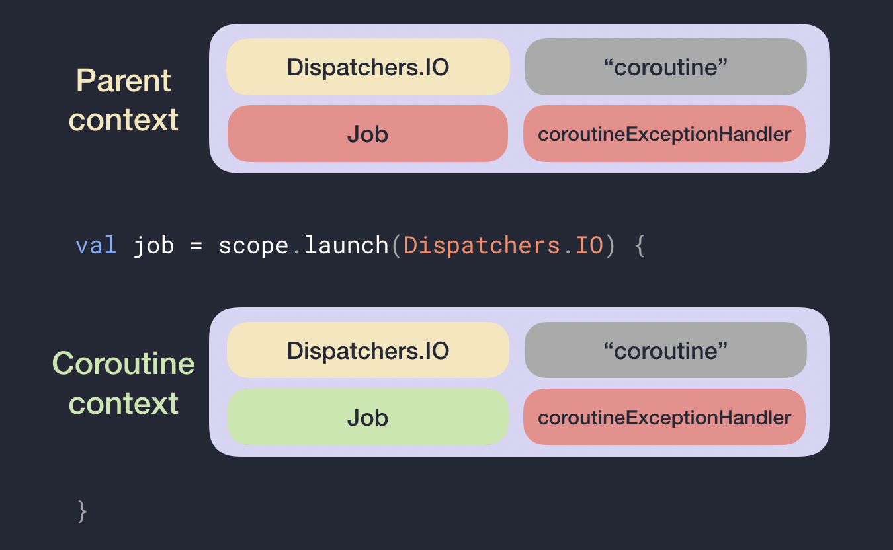

# koilin学习体验
* java的语法是简单的，但是为了避免空指针需要些很多判断。kotlin可以优雅的表达，编译期间就检查知否空指针
* effetctive java中是java高效使用java的典范，kotlin直接吸收默认实现的，比如class默认就是final的，组合优于继承
* collections的使用扩展常用方法，如过滤filter,转换map
* 常用设计模式的实现，如用于流的produce是生产消费者模式，with对一个对象实例调用多个方法有点像建造者模式
* lamda表达式极简使用，扩展函数有点像装饰模式
* 协程引入

# 参考
[https://www.kotlincn.net/docs/reference/](https://www.kotlincn.net/docs/reference/)
## kotlin-android-extensions

# when主语捕获到变量中
	fun Request.getBody() =
		when (val response = executeRequest()) {
			is Success -> response.body
			is HttpError -> throw HttpException(response.status)
		}
# 创建单例

	object Resource {
		val name = "Name"
	}

## 伴生对象
类内部的对象声明可以⽤ companion 关键字标记：

	class MyClass {
		companion object Factory {
			fun create(): MyClass = MyClass()
		}
	}

可以省略伴⽣对象的名称，在这种情况下将使⽤名称 

	class MyClass {
		companion object { }
	}
	val x = MyClass.Companion

## 静态static
接⼝中伴⽣对象的 @JvmStatic 与 @JvmField

	interface Foo {
		companion object {
			@JvmField
			val answer: Int = 42
			@JvmStatic
			fun sayHello() {
				println("Hello, world!")
			}
		}
	}
相当于这段 Java 代码：

	interface Foo {
		public static int answer = 42;
		public static void sayHello() {
		// ……
		}
	}

## by,notNull
	class App : Application() {
		companion object {
			var instance: App by Delegates.notNull()
		}
		override fun onCreate() {
			super.onCreate()
			instance = this
		}
	}

# 非空
## If not null 缩写

	val files = File("Test").listFiles()
	println(files?.size)

## If not null and else 缩写
	val files = File("Test").listFiles()
	println(files?.size ?: "empty")

## if null 执行一个语句
	val values = ……
	val email = values["email"] ?: throw IllegalStateException("Email is missing!")

## if not null 执行代码
	val value = ……
	value?.let {
	…… // 代码会执⾏到此处, 假如data不为null
	}

# 扩展
Kotlin能够扩展⼀个类的新功能⽽⽆需继承该类或者使⽤像装饰者这样的设计模式。 这通过叫做扩展的特殊声明完成。

## 扩展函数
类添加静态方法

# 作用域函数 apply/with/run/also/let
唯一目的是在对象的上下文中执行代码块。当对一个对象调用这样的函数并提供一个 lambda 表达式时，它会形成一个临时作用域。在此作用域中，可以访问该对象而无需其名称。这些函数称为作用域函数。

run, with, let, also, apply  都是作用域函数，这些作用域函数如何使用，以及如何区分呢，我们将从以下三个方面来区分它们。

* 是否是扩展函数。
* 作用域函数的参数（this、it）。
* 作用域函数的返回值（调用本身、其他类型即最后一行）。

首先我们来看一下 with 和 T.run，这两个函数非常的相似，他们的区别在于 with 是个普通函数，T.run 是个扩展函数，来看一下下面的例子。

	val name: String? = null
	with(name){
	    val subName = name!!.substring(1,2)
	}
	
	// 使用之前可以检查它的可空性
	name?.run { val subName = name.substring(1,2) }?:throw IllegalArgumentException("name must not be null")

作用域函数的参数（this、it）

T.run 和 T.let，它们都是扩展函数，但是他们的参数不一样 T.run 的参数是 this, T.let 的参数是 it。
	val name: String? = "hi-dhl.com"
	
	// 参数是 this，可以省略不写
	name?.run {
	    println("The length  is ${this.length}  this 是可以省略的 ${length}")
	}
	
	// 参数 it
	name?.let {
	    println("The length  is  ${it.length}")
	}
	
	// 自定义参数名字
	name?.let { str ->
	    println("The length  is  ${str.length}")
	}

T.let 和 T.also 它们接受的参数都是 it, 但是它们的返回值是不同的 T.let 返回最后一行，T.also 返回调用本身。
	var name = "hi-dhl"
	
	// 返回调用本身
	name = name.also {
	    val result = 1 * 1
	    "juejin"
	}
	println("name = ${name}") // name = hi-dhl
	
	// 返回的最后一行
	name = name.let {
	    val result = 1 * 1
	    "hi-dhl.com"
	}
	println("name = ${name}") // name = hi-dhl.com

从上面的例子来看 T.also 似乎没有什么意义，细想一下其实是非常有意义的，在使用之前可以进行自我操作，结合其他的函数，功能会更强大。

	fun makeDir(path: String) = path.let{ File(it) }.also{ it.mkdirs() }

## 引用上下文对象的方式
run、with 以及 apply 通过关键字 this 引用上下文对象。let 及 also 将上下文对象作为 lambda 表达式参数用it.
## 返回值
apply 及 also 的返回值是上下文对象本身。因此，它们可以作为辅助步骤包含在调用链中：你可以继续在同一个对象上进行链式函数调用。let、run 及 with 返回 lambda 表达式的结果。

# 接口

	interface MyInterface {
    	fun onLocationMeasured(location: Location)
	}
	val obj = object : MyInterface {
    	override fun onLocationMeasured(location: Location) { ... }
	}

# 类构造函数，初始化，属性构造
## lateinit var 

* lateinit var只能用来修饰类属性，不能用来修饰局部变量，并且只能用来修饰对象，不能用来修饰基本类型(因为基本类型的属性在类加载后的准备阶段都会被初始化为默认值)。
* lateinit var的作用也比较简单，就是让编译期在检查时不要因为属性变量未被初始化而报错。
* Kotlin相信当开发者显式使用lateinit var 关键字的时候，他一定也会在后面某个合理的时机将该属性对象初始化的(然而，谁知道呢，也许他用完才想起还没初始化)。

## lazy
lazy 应用于单例模式(if-null-then-init-else-return)，而且当且仅当变量被第一次调用的时候，委托方法才会执行。

lazy()是接受一个 lambda 并返回一个 Lazy <T> 实例的函数，返回的实例可以作为实现延迟属性的委托： 第一次调用 get() 会执行已传递给 lazy() 的 lambda 表达式并记录结果， 后续调用 get() 只是返回记录的结果。

	val lazyValue: String by lazy {
	    println("computed!")
	    "Hello"
	}
	
	fun main(args: Array<String>) {
	    println(lazyValue)
	    println(lazyValue)
	}
	
	打印结果
	computed！
	Hello
	
	Hello

lazy 传入的是一个lambda表达式，其中UnsafeLazyImpl是不安全的，SynchronizedLazyImpl用Synchronize实现安全，SynchronizedLazyImpl是通过AtomicReferenceFieldUpdater实现安全

	public actual fun <T> lazy(mode: LazyThreadSafetyMode, initializer: () -> T): Lazy<T> =
	    when (mode) {
	        LazyThreadSafetyMode.SYNCHRONIZED -> SynchronizedLazyImpl(initializer)SafePublicationLazyImpl
	        LazyThreadSafetyMode.PUBLICATION -> SafePublicationLazyImpl(initializer)
	        LazyThreadSafetyMode.NONE -> UnsafeLazyImpl(initializer)
	    }

	private class SafePublicationLazyImpl<out T>(initializer: () -> T) : Lazy<T>, Serializable {
	    @Volatile private var initializer: (() -> T)? = initializer
	    @Volatile private var _value: Any? = UNINITIALIZED_VALUE
	    // this final field is required to enable safe publication of constructed instance
	    private val final: Any = UNINITIALIZED_VALUE
	
	    override val value: T
	        get() {
	            val value = _value
	            if (value !== UNINITIALIZED_VALUE) {
	                @Suppress("UNCHECKED_CAST")
	                return value as T
	            }
	
	            val initializerValue = initializer
	            // if we see null in initializer here, it means that the value is already set by another thread
	            if (initializerValue != null) {
	                val newValue = initializerValue()
	                if (valueUpdater.compareAndSet(this, UNINITIALIZED_VALUE, newValue)) {
	                    initializer = null
	                    return newValue
	                }
	            }
	            @Suppress("UNCHECKED_CAST")
	            return _value as T
	        }
	
	    override fun isInitialized(): Boolean = _value !== UNINITIALIZED_VALUE
	
	    override fun toString(): String = if (isInitialized()) value.toString() else "Lazy value not initialized yet."
	
	    private fun writeReplace(): Any = InitializedLazyImpl(value)
	
	    companion object {
	        private val valueUpdater = java.util.concurrent.atomic.AtomicReferenceFieldUpdater.newUpdater(
	            SafePublicationLazyImpl::class.java,
	            Any::class.java,
	            "_value"
	        )
	    }
	}

## 单例模式
### 饿汉式实现
	//Java实现
	public class SingletonDemo {
	    private static SingletonDemo instance=new SingletonDemo();
	    private SingletonDemo(){
	
	    }
	    public static SingletonDemo getInstance(){
	        return instance;
	    }
	}
	//Kotlin实现
	object SingletonDemo

### 懒汉式

	//Java实现
	public class SingletonDemo {
	    private static SingletonDemo instance;
	    private SingletonDemo(){}
	    public static SingletonDemo getInstance(){
	        if(instance==null){
	            instance=new SingletonDemo();
	        }
	        return instance;
	    }
	}
	//Kotlin实现
	class SingletonDemo private constructor() {
	    companion object {
	        private var instance: SingletonDemo? = null
	            get() {
	                if (field == null) {
	                    field = SingletonDemo()
	                }
	                return field
	            }
	        fun get(): SingletonDemo{
	        //细心的小伙伴肯定发现了，这里不用getInstance作为为方法名，是因为在伴生对象声明时，内部已有getInstance方法，所以只能取其他名字
	         return instance!!
	        }
	    }
	}

### 双重校验锁式（Double Check)

	//Java实现
	public class SingletonDemo {
	    private volatile static SingletonDemo instance;
	    private SingletonDemo(){} 
	    public static SingletonDemo getInstance(){
	        if(instance==null){
	            synchronized (SingletonDemo.class){
	                if(instance==null){
	                    instance=new SingletonDemo();
	                }
	            }
	        }
	        return instance;
	    }
	}
	//kotlin实现
	class SingletonDemo private constructor() {
	    companion object {
	        val instance: SingletonDemo by lazy(mode = LazyThreadSafetyMode.SYNCHRONIZED) {
	        SingletonDemo() }
	    }
	}

### 静态内部类

	//Java实现
	public class SingletonDemo {
	    private static class SingletonHolder{
	        private static SingletonDemo instance=new SingletonDemo();
	    }
	    private SingletonDemo(){
	        System.out.println("Singleton has loaded");
	    }
	    public static SingletonDemo getInstance(){
	        return SingletonHolder.instance;
	    }
	}
	//kotlin实现
	class SingletonDemo private constructor() {
	    companion object {
	        val instance = SingletonHolder.holder
	    }
	
	    private object SingletonHolder {
	        val holder= SingletonDemo()
	    }
	
	}

## 嵌套类，内部类inner，匿名内部类
# 泛型
# 协程
协程是一种脱离语言的概念，它是一种编程思想，并不局限于特定的语言。本质上来说。协程就是一段程序，它能够被挂起，待会儿再恢复执行。语言会对协程有自己的实现。

协程(coroutine)的概念根据Donald Knuth的说法早在1958年就由Melvin Conway提出了，对应wikipedia的定义如下

	Coroutines are computer program components that generalize subroutines for non-preemptive multitasking, by allowing execution to be suspended and resumed. Coroutines are well-suited for implementing familiar program components such as cooperative tasks, exceptions, event loops, iterators, infinite lists and pipes.

子例程(subroutine)是一个概括性的术语，子例程可以是整个程序中的一个代码区块，当它被主程序调用的时候就会进入运行。例如函数就是子例程中的一种。协程相比子例程更加的灵活，允许执行过程中被挂起和恢复，多个协程可以一起相互协作执行任务。从协程(co + routine)名字上来拆解为支持协作(cooperate)的例程。
## 进程、线程、协程的关系和比较

* 进程是资源分配的最小单位，会拥有独立的地址空间以及对应的内存空间，还有网络和文件资源等，不同进程之间资源都是独立的，可以通过进程间通信（管道、共享内存、信号量等方式）来进行交互。
* 线程为CPU调度的基本单位，除了拥有运行中必不可少的信息(如程序计数器、一组寄存器和栈)以外，本身并不拥有系统资源，所有线程会共享进程的资源，比如会共享堆资源。
* 协程可以认为是运行在线程上的代码块，协程提供的挂起操作会使协程暂停执行，而不会导致线程阻塞。一个线程内部可以创建几千个协程都没有任何问题。
* 进程的切换和线程切换中都包含了对应上下文的切换，这块都涉及到了内核来完成，即一次用户态到内核态的切换和一次内核态到用户态的切换。因为进程上下文切换保存的信息更多，所以进程切换代价会比线程切换代价更大。
* 协程是一个纯用户态的并发机制，同一时刻只会有一个协程在运行，其他协程挂起等待；不同协程之间的切换不涉及内核，只用在用户态切换即可，所以切换代价更小，更轻量级，适合IO密集型的场景。

## kotlin协程
在JVM的平台上，并灭有提供对协程的原生支持，完全依赖编译器技术支持。Kotlin协程在代码层面实现要基于线程池的工具API,所以Kotlin协程不属于广义上的协程，更像是一个线程框架。

### kotlin协程原理
* 挂起函数：suspend修饰标记的函数。挂起函数不能再常规代码中被调用，只能在其他挂起函数或是挂起lambda表达式中
* 协程构建器：使用一些挂起lambda表达式作为参数来创建的一个协程的函数，如launch(),async()
* 在协程等待的过程中, 线程会返回线程池, 当协程等待结束, 协程会在线程池中一个空闲的线程上恢复. (The thread is returned to the pool while the coroutine is waiting, and when the waiting is done, the coroutine resumes on a free thread in the pool.)

### CPS(Continuation-Passing-Style Transformation)
	//编译前
	suspend fun request():Int
	//编译后
	fun requesT(continuation:Continuation<T>):Any?

* suspend函数都有一个Continuation类型的隐式参数，并且都能通过这个参数拿到一个Continuation类型对象
* 返回类型变成Any,因为挂起函数被花旗，会返回COROUTINE_SUSPENDED;否则执行完毕直接返回一个结果或是异常，需要一个联合标识

### Continutiaon续体,表示挂起协程的在挂起点时的状态，可以用“剩余计算”来称呼。
剩余计算

	val str =1024.toString()//#1
	val length=str.length//#2
	println(length)//#3

加入吧#1，#2和#3分成两部分代码段，#2，#3的代码可以合并表示为println(x.length),然后改写成一个lambda表达式

	{s:String->println(s.length)}
这样，我们就可以通过把#1的结果传递给lambda来重新构建原始的形式：

	{s:String->println(s.length)}.invoke(1024.toString())
这个lambda表达式就是#1的Continuation,通过它的invoke方法可以执行剩余计算

### 状态机
挂起点：协成执行过程中可能被挂起的位置。可理解为剩余计算各种可能点。每一个挂起点和初始挂起点对应的Continuation都会转为为一种状态，协程恢复只是跳到下一种状态中。

协程在挂起前，会先保存所有的局部变量以及在下次resume后要执行的代码片段（根据lable的值判断），这个保存状态和局部变量的对象就叫状态机
考虑用状态机来实现协程是尽可能少的创建类和对象

### 总结
1.在执行suspend函数时，（CPS传递Continuation参数）挂起，暂时不执行剩下的协程代码

2.当suspend函数执行完毕，通过Continuation参数的resume()进行回调，继续执行
	
	@SinceKotlin("1.3")
	public interface Continuation<in T> {
	    /**
	     * The context of the coroutine that corresponds to this continuation.
	     */
	    public val context: CoroutineContext
	
	    /**
	     * Resumes the execution of the corresponding coroutine passing a successful or failed [result] as the
	     * return value of the last suspension point.
	     */
	    public fun resumeWith(result: Result<T>)
	}
	
	/**
	 * Classes and interfaces marked with this annotation are restricted when used as receivers for extension
	 * `suspend` functions. These `suspend` extensions can only invoke other member or extension `suspend` functions on this particular
	 * receiver and are restricted from calling arbitrary suspension functions.
	 */
	@SinceKotlin("1.3")
	@Target(AnnotationTarget.CLASS)
	@Retention(AnnotationRetention.BINARY)
	public annotation class RestrictsSuspension
	
	/**
	 * Resumes the execution of the corresponding coroutine passing [value] as the return value of the last suspension point.
	 */
	@SinceKotlin("1.3")
	@InlineOnly
	public inline fun <T> Continuation<T>.resume(value: T): Unit =
	    resumeWith(Result.success(value))
	
	/**
	 * Resumes the execution of the corresponding coroutine so that the [exception] is re-thrown right after the
	 * last suspension point.
	 */
	@SinceKotlin("1.3")
	@InlineOnly
	public inline fun <T> Continuation<T>.resumeWithException(exception: Throwable): Unit =
	    resumeWith(Result.failure(exception))
## 启动协程
### runBlocking，连接blocking和non-blocking的世界
runBlocking用来连接阻塞和非阻塞的世界.

runBlocking可以建立一个阻塞当前线程的协程. 所以它主要被用来在main函数中或者测试中使用, 作为连接函数.

	fun main() = runBlocking<Unit> {
	    // start main coroutine
	    GlobalScope.launch {
	        // launch a new coroutine in background and continue
	        delay(1000L)
	        println("World! + ${Thread.currentThread().name}")
	    }
	    println("Hello, + ${Thread.currentThread().name}") // main coroutine continues here immediately
	    delay(2000L) // delaying for 2 seconds to keep JVM alive
	}
### launch
返回Job，上面的例子delay了一段时间来等待一个协程结束, 不是一个好的方法.

launch返回Job, 代表一个协程, 我们可以用Job的join()方法来显式地等待这个协程结束:

	fun main() = runBlocking {
	    val job = GlobalScope.launch {
	        // launch a new coroutine and keep a reference to its Job
	        delay(1000L)
	        println("World! + ${Thread.currentThread().name}")
	    }
	    println("Hello, + ${Thread.currentThread().name}")
	    job.join() // wait until child coroutine completes
	}
### async，从协程返回值
async开启协程, 返回Deferred<T>, Deferred<T>是Job的子类, 有一个await()函数, 可以返回协程的结果.

await()也是suspend函数, 只能在协程之内调用.

	fun main() = runBlocking {
	    // @coroutine#1
	    println(Thread.currentThread().name)
	    val deferred: Deferred<Int> = async {
	        // @coroutine#2
	        loadData()
	    }
	    println("waiting..." + Thread.currentThread().name)
	    println(deferred.await()) // suspend @coroutine#1
	}
	
	suspend fun loadData(): Int {
	    println("loading..." + Thread.currentThread().name)
	    delay(1000L) // suspend @coroutine#2
	    println("loaded!" + Thread.currentThread().name)
	    return 42
	}
## CoroutineScope, CoroutineContext,CoroutineStart，Job，CoroutineExceptionHandler

	public fun CoroutineScope.launch(
	    context: CoroutineContext = EmptyCoroutineContext,
	    start: CoroutineStart = CoroutineStart.DEFAULT,
	    block: suspend CoroutineScope.() -> Unit
	): Job {
	...
	}

协程总是在一个context下运行, 类型是接口CoroutineContext. 协程的context是一个索引集合, 其中包含各种元素, 重要元素就有Job和dispatcher. 

构建协程的coroutine builder: launch, async, 都是CoroutineScope类型的扩展方法. 查看CoroutineScope接口, 其中含有CoroutineContext的引用
### CoroutineStart 启动模式

	public enum class CoroutineStart {
	   
	    DEFAULT,
	
	    
	    LAZY,
	
	   
	    @ExperimentalCoroutinesApi
	    ATOMIC,
	
	
	    @ExperimentalCoroutinesApi
	    UNDISPATCHED;
	}

* CoroutineStart.Default 不需要收到调用Job对象的join()或start()等方法，而是调用launch()方法的时候就会定执行协程体的代码
* CoroutineStart.LAZY 一定要手动调用Job对象的join()或start()方法，否则协程体不会执行

### CoroutineContext
它包含用户定义的一些数据集合，这些数据与协程密切相关。它类似于map集合，可以通过key来获取不同类型的数据。

	public interface CoroutineContext {
	    /**
	     * Returns the element with the given [key] from this context or `null`.
	     */
	    public operator fun <E : Element> get(key: Key<E>): E?
	
	    /**
	     * Accumulates entries of this context starting with [initial] value and applying [operation]
	     * from left to right to current accumulator value and each element of this context.
	     */
	    public fun <R> fold(initial: R, operation: (R, Element) -> R): R
	
	    /**
	     * Returns a context containing elements from this context and elements from  other [context].
	     * The elements from this context with the same key as in the other one are dropped.
	     */
	    public operator fun plus(context: CoroutineContext): CoroutineContext =
	        if (context === EmptyCoroutineContext) this else // fast path -- avoid lambda creation
	            context.fold(this) { acc, element ->
	                val removed = acc.minusKey(element.key)
	                if (removed === EmptyCoroutineContext) element else {
	                    // make sure interceptor is always last in the context (and thus is fast to get when present)
	                    val interceptor = removed[ContinuationInterceptor]
	                    if (interceptor == null) CombinedContext(removed, element) else {
	                        val left = removed.minusKey(ContinuationInterceptor)
	                        if (left === EmptyCoroutineContext) CombinedContext(element, interceptor) else
	                            CombinedContext(CombinedContext(left, element), interceptor)
	                    }
	                }
	            }
	
	    /**
	     * Returns a context containing elements from this context, but without an element with
	     * the specified [key].
	     */
	    public fun minusKey(key: Key<*>): CoroutineContext
	
	    /**
	     * Key for the elements of [CoroutineContext]. [E] is a type of element with this key.
	     */
	    public interface Key<E : Element>
	
	    /**
	     * An element of the [CoroutineContext]. An element of the coroutine context is a singleton context by itself.
	     */
	    public interface Element : CoroutineContext {
	        /**
	         * A key of this coroutine context element.
	         */
	        public val key: Key<*>
	
	        public override operator fun <E : Element> get(key: Key<E>): E? =
	            @Suppress("UNCHECKED_CAST")
	            if (this.key == key) this as E else null
	
	        public override fun <R> fold(initial: R, operation: (R, Element) -> R): R =
	            operation(initial, this)
	
	        public override fun minusKey(key: Key<*>): CoroutineContext =
	            if (this.key == key) EmptyCoroutineContext else this
	    }
	}

Job,Dispatchers,CoroutineName,CoroutineExceptionHandler都实现了Element接口。

如果需要结合不同的CoroutineContext可以直接通过+拼接，本质就是使用了plus方法。

	class CoroutineName(val name: String) : CoroutineContext.Element {
		// companion object 是一个类对象，理所应当的，它能继承其他类
	    companion object : CoroutineContext.Key<CoroutineName>
	    override val key = CoroutineName
	}
	
	fun main() = runBlocking {
	    GlobalScope.launch(Dispatchers.IO + CoroutineName("my coroutine")) {
	    	// CoroutineName 的 companion object 继承的是 Key<CoroutineName>，
	    	// 所以 coroutineContext[CoroutineName] 的类型是 CoroutineName？
	        val name = coroutineContext[CoroutineName]?.name ?: "no name"
	        println("name = $name")
	    }
	    Unit
	}
	// 打印：
	// name = my coroutine
	
	// 或者更常见的：
	// 这里的 + 使用的是 CoroutineContext 里定义的 operator plus
	someCoroutineScope.launch(Dispatchers.IO + CoroutineName("my coroutine")) {
	    val name = coroutineContext[CoroutineName]?.name ?: return
	    // ...
	}

由于这种定义 context 是固定的模型，kotlin 还提供了一个便捷类AbstractCoroutineContextElement,内部类CombinedContext左向链表

	class CoroutineName(val name: String) : AbstractCoroutineContextElement(CoroutineName) {
	    companion object : CoroutineContext.Key<CoroutineName>
	}
	...
	internal class CombinedContext(
	    private val left: CoroutineContext,
	    private val element: Element
	) : CoroutineContext, Serializable {
	
	    override fun <E : Element> get(key: Key<E>): E? {
	        var cur = this
	        while (true) {
	            cur.element[key]?.let { return it }
	            val next = cur.left
	            if (next is CombinedContext) {
	                cur = next
	            } else {
	                return next[key]
	            }
	        }
	    }

### Job
Job对象表示一个协程作业，是协程的唯一标识，并负责管理协程的生命周期。它还可以由层级关系，一个Job可以包含多个字Job，Job 经历以下一系列状态：新建、活动、正在完成、已完成、正在取消和已取消状态。虽然我们无法访问状态本身，但可以访问Job 的属性: isActive 、isCancelled 和 isCompleted 。

如果协程处于活动状态，则协程失败或调用job.cancel()方法将使Job处于取消状态( isActive = false, iscancel = true )。一旦所有的子协程完成了他们的工作，协程将进入取消状态并且 isCompleted = true 。
### Dispatchers和线程
Context中的CoroutineDispatcher可以指定协程运行在什么线程上. 可以是一个指定的线程, 线程池, 或者不限.

API提供了几种选项:
* Dispatchers.Default代表使用JVM上的共享线程池, 其大小由CPU核数决定, 不过即便是单核也有两个线程. 通常用来做CPU密集型工作, 比如排序或复杂计算等.
* Dispatchers.Main指定主线程, 用来做UI更新相关的事情. (需要添加依赖, 比如kotlinx-coroutines-android.) 如果我们在主线程上启动一个新的协程时, 主线程忙碌, 这个协程也会被挂起, 仅当线程有空时会被恢复执行.
* Dispatchers.IO: 采用on-demand创建的线程池, 用于网络或者是读写文件的工作.
* Dispatchers.Unconfined: 不指定特定线程, 这是一个特殊的dispatcher.

如果不明确指定dispatcher, 协程将会继承它被启动的那个scope的context(其中包含了dispatcher).

### Scope作用域，scope的主要作用就是记录所有的协程, 并且可以取消它们.
当launch, async或runBlocking开启新协程的时候, 它们自动创建相应的scope. 所有的这些方法都有一个带receiver的lambda参数, 默认的receiver类型是CoroutineScope.

	fun main() = runBlocking {
	    /* this: CoroutineScope */
	    launch { /* ... */ }
	    // the same as:
	    this.launch { /* ... */ }
	}

因为launch是一个扩展方法, 所以上面例子中默认的receiver是this.
这个例子中launch所启动的协程被称作外部协程(runBlocking启动的协程)的child. 这种"parent-child"的关系通过scope传递: child在parent的scope中启动.

协程的父子关系:

* 当一个协程在另一个协程的scope中被启动时, 自动继承其context, 并且新协程的Job会作为父协程Job的child.
所以, 关于scope目前有两个关键知识点:

* 我们开启一个协程的时候, 总是在一个CoroutineScope里.
* Scope用来管理不同协程之间的父子关系和结构.

协程的父子关系有以下两个特性:

* 父协程被取消时, 所有的子协程都被取消.
* 父协程永远会等待所有的子协程结束.

值得注意的是, 也可以不启动协程就创建一个新的scope. 创建scope可以用工厂方法: MainScope()或CoroutineScope().

coroutineScope()方法也可以创建scope. 当我们需要以结构化的方式在suspend函数内部启动新的协程, 我们创建的新的scope, 自动成为suspend函数被调用的外部scope的child.

总结：A CoroutineScope keeps track of all your coroutines, and it can cancel all of the coroutines started in it.

### CoroutineContext计算
协程上下文是基于这个公式计算的：父级上下文 = 默认值 + 继承的上下文 + 参数

* 某些元素具有默认值，如 Dispatchers.Default 是协程调度器（ CoroutineDispatcher ）的默认值，“coroutine”是 CoroutineName 的默认值。
* 协程会继承创建它的协程作用域或协程的 CoroutineContext 。
* 在协程构建器中传递的参数会优先于继承的 CoroutineContext 中的元素。

### Structured Concurrency结构化并发
这种利用scope将协程结构化组织起来的机制, 被称为"structured concurrency".
好处是:

* scope自动负责子协程, 子协程的生命和scope绑定.
* scope可以自动取消所有的子协程.
* scope自动等待所有的子协程结束. 如果scope和一个parent协程绑定, 父协程会等待这个scope中所有的子协程完成.

通过这种结构化的并发模式: 我们可以在创建top级别的协程时, 指定主要的context一次, 所有嵌套的协程会自动继承这个context, 只在有需要的时候进行修改即可.

 async 被定义为了 CoroutineScope 上的扩展，我们需要将它写在作用域内，并且这是 coroutineScope 函数所提供的：

	suspend fun concurrentSum(): Int = coroutineScope {
	    val one = async { doSomethingUsefulOne() }
	    val two = async { doSomethingUsefulTwo() }
	    one.await() + two.await()
	}

这种情况下，如果在 concurrentSum 函数内部发生了错误，并且它抛出了一个异常， 所有在作用域中启动的协程都会被取消。

#### SupervisorJob
内部的取消操作是单向传播，子协程错误不会传播给父协程和它的兄弟协程。这个特性只作用直接子线程，其子线程遵守默认规则

### CoroutineExceptionHandler

	fun main() = runBlocking {
	        val job = GlobalScope.launch { // launch 根协程
	            println("Throwing exception from launch")
	            throw IndexOutOfBoundsException() // 我们将在控制台打印 Thread.defaultUncaughtExceptionHandler
	        }
	        job.join()
	        println("Joined failed job")
	        val deferred = GlobalScope.async { // async 根协程
	            println("Throwing exception from async")
	            throw ArithmeticException() // 没有打印任何东西，依赖用户去调用等待
	        }
	        try {
	            deferred.await()
	            println("Unreached")
	        } catch (e: ArithmeticException) {
	            println("Caught ArithmeticException")
	        }
	    }

* 抛出 CancellationException 或者调用cancel()只会取消当前协程和子协程，不会取消父协程，也不会其他例如打印堆栈信息等的异常处理操作。
* 抛出未捕获的非 CancellationException 异常会取消子协程和自己，也会取消父协程，一直取消 root 协程，异常也会由 root 协程处理。
* 如果使用了 SupervisorJob 或 supervisorScope，子协程抛出未捕获的非 CancellationException 异常不会取消父协程，异常也会由子协程自己处理。
* launch式协程和actor式协程默认处理异常的方式只是打印堆栈信息，可以自定义 CoroutineExceptionHandler 来处理异常。
* async式协程本身不会处理异常，自定义 CoroutineExceptionHandler 也无效，但是会在await()恢复调用者协程时重新抛出异常。

## 协程在Android中应用

我们先定义三个Task，模拟上述场景， Task3 基于 Task1、Task2 返回的结果拼接字符串，每个 Task 通过 sleep 模拟耗时

	val task1: () -> String = {
	    sleep(2000)
	    "Hello".also { println("task1 finished: $it") }
	}
	
	val task2: () -> String = {
	    sleep(2000)
	    "World".also { println("task2 finished: $it") }
	}
	
	val task3: (String, String) -> String = { p1, p2 ->
	    sleep(2000)
	    "$p1 $p2".also { println("task3 finished: $it") }
	}

	@Test
	fun test_coroutine() {
	
	    runBlocking {
	        val c1 = async(Dispatchers.IO) {
	            task1()
	        }
	
	        val c2 = async(Dispatchers.IO) {
	            task2()
	        }
	
	        task3(c1.await(), c2.await())
	    }
	}

	@Test
	fun test_flow() {
	
	    val flow1 = flow<String> { emit(task1()) }
	    val flow2 = flow<String> { emit(task2()) }
	
	    runBlocking {
	         flow1.zip(flow2) { t1, t2 ->
	             task3(t1, t2)
	        }.flowOn(Dispatchers.IO)
	        .collect{  }
	
	    }
	
	}

### viewModelScope

我们在Activity或Fragment中使用协程时，要尽量避免使用GlobalScope。GlobalScope是生命周期是process级别的，所以上面的例子中，即使Activity或Fragment已经被销毁，协程仍然在执行。

	class MainViewModel : ViewModel() {
	    // Make a network request without blocking the UI thread
	    private fun makeNetworkRequest() {
	       // launch a coroutine in viewModelScope 
	        viewModelScope.launch(Dispatchers.IO) {
	            // slowFetch()
	        }
	    }
	
	    // No need to override onCleared()
	}

### lifecycleScope

	class MainActivity : AppCompatActivity() {
	    override fun onCreate(savedInstanceState: Bundle?) {
	        super.onCreate(savedInstanceState)
	        setContentView(R.layout.activity_main)
	        setSupportActionBar(toolbar)
	
	        lifecycleScope.launch { 
	            val data = withContext(Dispatchers.IO) {
	                loadData()
	            }
	            initUi(data)
	        }
	    }
	    ...
	}
	
	class MyFragment: Fragment() {
	    override fun onViewCreated(view: View, savedInstanceState: Bundle?) {
	        super.onViewCreated(view, savedInstanceState)
	        viewLifecycleOwner.lifecycleScope.launch { 
	            val data = withContext(Dispatchers.IO) {
	                loadData()
	            }
	            initUi(data)
	        }
	    }
	    ...
	}

特定生命周期阶段

尽管scope提供了自动取消的方式, 你可能还有一些需求需要限制在更加具体的生命周期内.

比如, 为了做FragmentTransaction, 你必须等到Lifecycle至少是STARTED.

上面的例子中, 如果需要打开一个新的fragment:

	fun onCreate() {
	    lifecycleScope.launch {
	        val note = userViewModel.loadNote()
	        fragmentManager.beginTransaction()....commit() //IllegalStateException
	    }
	}

很容易发生IllegalStateException.

Lifecycle提供了:
lifecycle.whenCreated, lifecycle.whenStarted, lifecycle.whenResumed.

如果没有至少达到所要求的最小生命周期, 在这些块中启动的协程任务, 将会suspend.

	fun onCreate() {
	    lifecycleScope.launchWhenStarted {
	        val note = userViewModel.loadNote()
	        fragmentManager.beginTransaction()....commit()
	    }
	}

### LiveData

	class MyViewModel: ViewModel() {
	    private val userId: LiveData<String> = MutableLiveData()
	    val user = userId.switchMap { id ->
	        liveData(context = viewModelScope.coroutineContext + Dispatchers.IO) {
	            emit(database.loadUserById(id))
	        }
	    }
	}

### Retrofit 
Retrofit从2.6.0开始提供了对协程的支持.
定义方法的时候加上suspend关键字:

	interface GitHubService {
	    @GET("orgs/{org}/repos?per_page=100")
	    suspend fun getOrgRepos(
	        @Path("org") org: String
	    ): List<Repo>
	}
# 空安全
不可空

	//在其方法体中我们获取了传入字符串的长度
	fun m1(str: String) {
	    str.length
	}

字节码可知，该方法的入参会被加上非空注解，之后，kotlin编译器内部调用了是否为null的检查，这就是为什么我们传入null的时候会编译报错

	public final static m1(Ljava/lang/String;)V
	    @Lorg/jetbrains/annotations/NotNull;() // invisible, parameter 0
	   L0
	    ALOAD 0
	    LDC "str"
	    INVOKESTATIC kotlin/jvm/internal/Intrinsics.checkParameterIsNotNull (Ljava/lang/Object;Ljava/lang/String;)V
	   L1
	    LINENUMBER 6 L1
	    ALOAD 0
	    INVOKEVIRTUAL java/lang/String.length ()I
	    POP
	   L2
	    LINENUMBER 7 L2
	    RETURN
	   L3
	    LOCALVARIABLE str Ljava/lang/String; L0 L3 0
	    MAXSTACK = 2
	    MAXLOCALS = 1

可空

	//在其方法体中我们采用了安全调用操作符 ?. 来获取传入字符串的长度
	fun m2(str: String?) {
	    str?.length
	}
字节码，m2的入参被加上了可为null的注解，kotlin编译器对该场景做了如下处理：如果为null则什么都不做，否则直接调用str的length方法
	// 
	  public final static m2(Ljava/lang/String;)V
	    @Lorg/jetbrains/annotations/Nullable;() // invisible, parameter 0
	   L0
	    LINENUMBER 10 L0
	    ALOAD 0
	    DUP
	    IFNULL L1
	    INVOKEVIRTUAL java/lang/String.length ()I
	    POP
	    GOTO L2
	   L1
	    POP
	   L2
	   L3
	    LINENUMBER 11 L3
	    RETURN
	   L4
	    LOCALVARIABLE str Ljava/lang/String; L0 L4 0
	    MAXSTACK = 2
	    MAXLOCALS = 1

强制非空

	fun m3(str: String?) {
    	str!!.length
	}
字节码入参同样被标注为了可为null，传入为null的字符串直接抛出空指针异常，否则调用其length方法

	public final static m3(Ljava/lang/String;)V
	    @Lorg/jetbrains/annotations/Nullable;() // invisible, parameter 0
	   L0
	    LINENUMBER 15 L0
	    ALOAD 0
	    DUP
	    IFNONNULL L1
	    INVOKESTATIC kotlin/jvm/internal/Intrinsics.throwNpe ()V
	   L1
	    INVOKEVIRTUAL java/lang/String.length ()I
	    POP
	   L2
	    LINENUMBER 16 L2
	    RETURN
	   L3
	    LOCALVARIABLE str Ljava/lang/String; L0 L3 0
	    MAXSTACK = 3
	    MAXLOCALS = 1